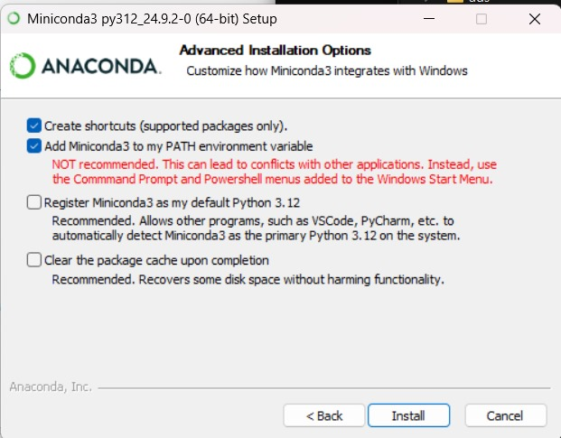

## Python Introduction

This repository will contain notebooks to help get started with python and learn the fundamentals. It's split into the
following chapters which each have a notebook (Chapter 12-18 are still in development):

* Chapter 01: Introduction to Python
* Chapter 02: Python Data Types
* Chapter 03: Python Operators
* Chapter 04: Python Collections
* Chapter 05: Python Flow Control
* Chapter 06: Python Functions
* Chapter 07: Python Classes
* Chapter 08: Python Modules & Packages
* Chapter 09: Python File I/O
* Chapter 10: Python Exceptions
* Chapter 11: Python Libraries
* Chapter 12: NumPy
* Chapter 13: Pandas
* Chapter 14: Matplotlib
* Chapter 15: SciPy
* Chapter 16: Dask
* Chapter 17: Neuroimaging in Python
* Chapter 18: Neuroinformatics in Python

### Getting Started

To get started, you'll need to have Python installed on your machine. To ensure you have a clean python enviornment for
this tutorial, we will be using Miniconda. You can download it [here](https://docs.conda.io/en/latest/miniconda.html).

For Windows users specifically, during the installation process, check the box that says "Add Miniconda3 to my
PATH environment variable". See the screenshot below for reference:



After installing Anaconda, restart any command prompt or terminal windows you have open.

### Downloading the Repository

#### Downloading from the Browser

There are two ways you can download the notebooks and supporting code. One way is to download the repository as a zip
file. To do this, you can go to the top of this page and click on the green "Code" button and then click on "Download
ZIP". This will download the repository as a zip file which you can extract to a folder on your machine. After
downloading, extract the zip file.

#### Downloading via Git

The second way is using git, if you have it installed. You can run the following command in a terminal (MacOs/Linux) or
command prompt (Windows) to clone the repository:
Only copy the relevant lines form the block below, the comments might not play well with the terminal you are using.

```bash
git clone https://github.com/FIrgolitsch/Python-Intro.git
```

#### File management

After downloading the repository, you can move the folder to a location where you can easily access it. You can also
rename the folder to something more memorable if you'd like. You will need this location in the steps below.

### Running the Notebooks

To run the notebooks, you'll need to have Jupyter installed. You can set up a minimal environment by running the
following commands (with Anaconda or Miniconda installed) in a terminal (MacOs/Linux, search for `terminal` in
spotlight (MacOS) or in the application directory (Linux)) or command prompt (Windows, search in the start menu for
`cmd`):

```bash
# This will create a new environment called python-intro with Python 3.10 and Jupyter installed
conda create -n python-intro python=3.10 jupyter

# This will activate the environment
conda activate python-intro

```

Before we execute the next command, we need to navigate to the folder where we downloaded the repository. Remember the
location where you downloaded the repository? You need to navigate to that location in the terminal or command prompt
using the `cd` command. For example, `cd Downloads/Python-Intro-main/` if you downloaded the repository to the downloads
folder on windows and extracted it there.

```bash
# This will install the required packages (run this in the folder of the repository, the "python-intro" 
# folder where you downloaded the code)
pip install -r requirements.txt

# This will start Jupyter
jupyter lab
```

This will open a new tab in your browser where you can navigate to the notebooks and run them. From there, you can start
with chapter one of this tutorial.
